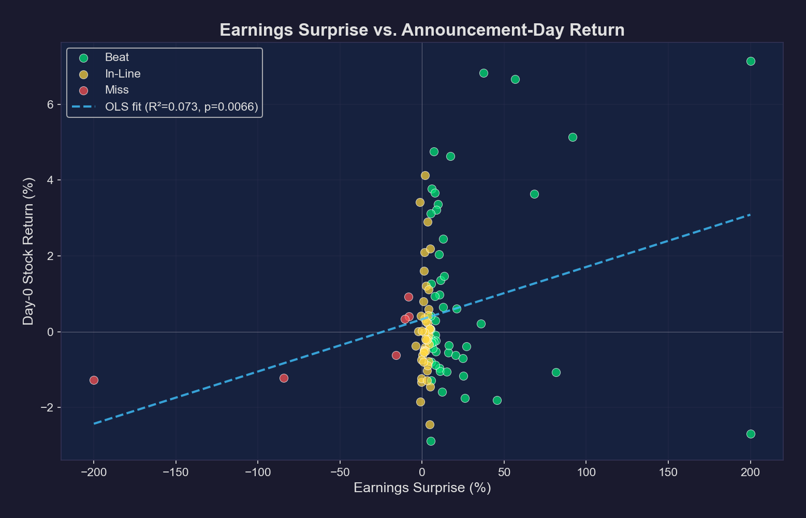
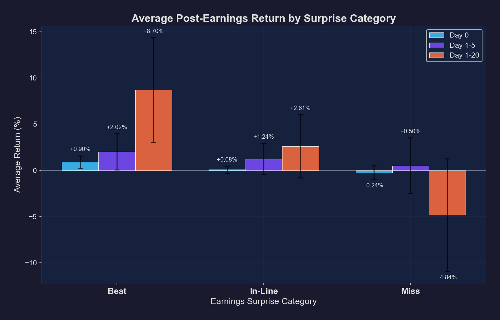
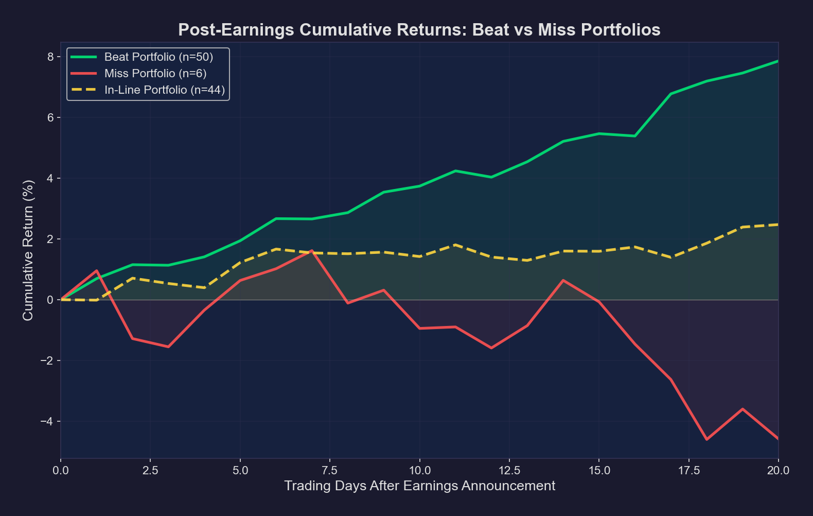
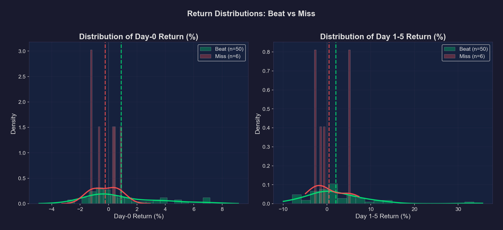
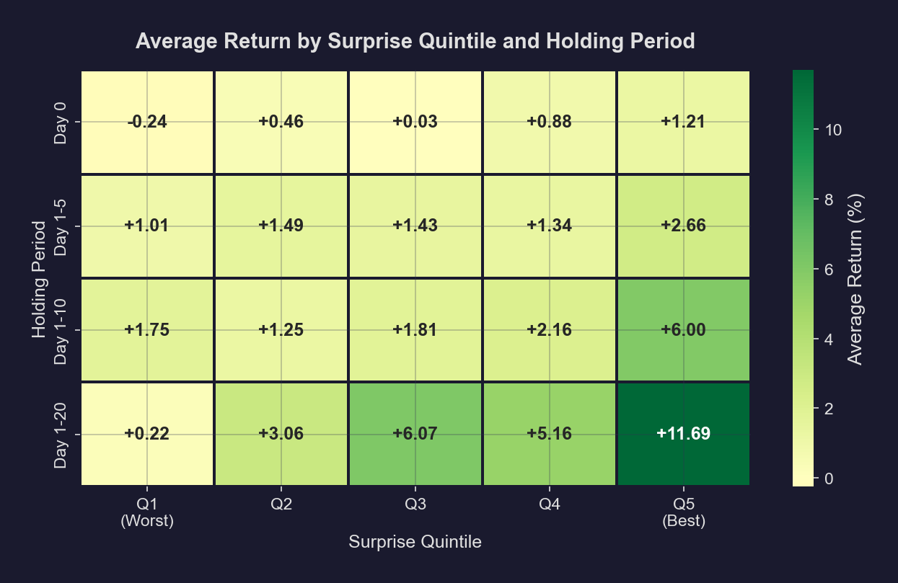
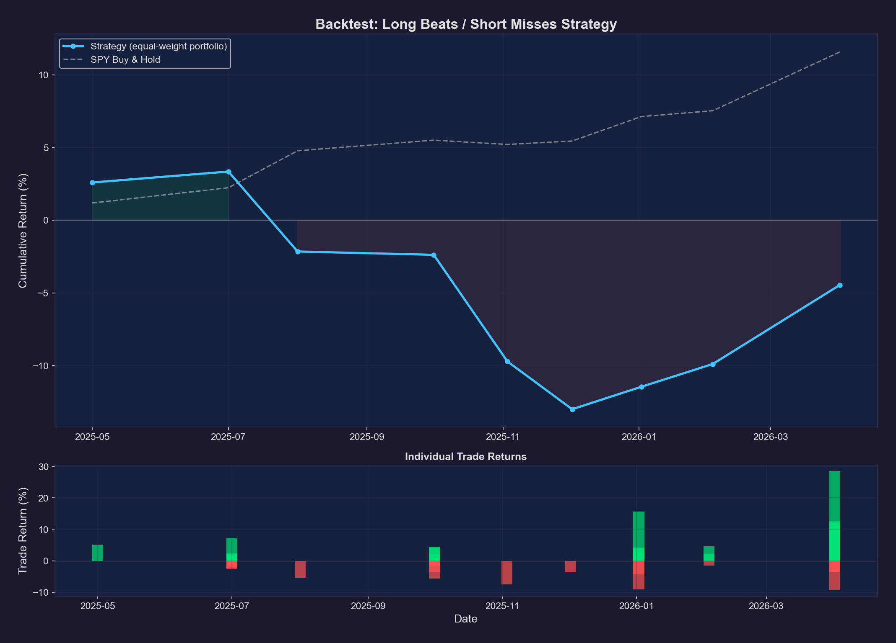

# Earnings Surprise Analyzer

Empirical study of **Post-Earnings Announcement Drift (PEAD)** on 25 S&P 500 mega-caps. Fetches real earnings data, measures multi-window returns, runs significance tests, and backtests a long-beat / short-miss strategy.

---

## Contents

1. [What is PEAD?](#what-is-pead)
2. [Methodology](#methodology)
3. [Key Findings](#key-findings)
4. [Charts](#charts)
5. [Backtest](#backtest)
6. [Caveats](#caveats)
7. [How to Run](#how-to-run)

---

## What is PEAD?

**Post-Earnings Announcement Drift** is the tendency for a stock to keep moving in the direction of its earnings surprise for weeks after the announcement. In an efficient market this shouldn't happen — prices should jump once and then trade randomly. PEAD has been documented since Ball & Brown (1968), and the leading explanations are investor underreaction, anchoring on prior estimates, and limits to arbitrage.

---

## Methodology

- **Universe**: 25 mega-cap S&P 500 names across 8 sectors
- **Benchmark**: SPY for market-adjusted returns
- **Window**: 4 quarters (~100 earnings events)
- **Source**: Yahoo Finance via `yfinance`

**Surprise definition** — `(Actual EPS − Estimated EPS) / |Estimated EPS| × 100`. Bucketed as **Beat** (> +5%), **In-Line** (±5%), or **Miss** (< −5%).

**Return windows** — Day 0 (announcement), Day 1–5, Day 1–10, Day 1–20. Both raw and SPY-adjusted.

**Stats** — Welch's t-test (Beat vs. Miss), one-sample t-test vs. zero, and Pearson/Spearman correlation between surprise size and forward return.

---

## Key Findings

The Beat–Miss spread **widens with the holding period** — the hallmark of PEAD:

| Window     | Beat avg | Miss avg | Spread     | p-value  |
|------------|---------:|---------:|-----------:|---------:|
| Day 0      |  +0.90%  |  −0.24%  | **+1.14%** | 0.041 \* |
| Day 1–10   |  +4.05%  |  −1.14%  | **+5.19%** | 0.033 \* |
| Day 1–20   |  +8.70%  |  −4.84%  | **+13.54%**| 0.006 \*\*|

Pearson correlation between surprise size and forward return also rises with horizon: **r = 0.27** at Day 0 → **r = 0.50** at Day 20 (p < 0.0001). Even after subtracting SPY, the Day-20 Beat–Miss spread remains **+12.3%** (p = 0.009).

---

## Charts

Each chart below tells a different part of the PEAD story.

### 1. Scatter — Surprise % vs. Day-0 Return



**Shows** — Every earnings event as a single dot: x-axis is the surprise size, y-axis is the same-day stock reaction. Points are colored by category and a dashed OLS line is fitted through all points.

**Tells us** — Bigger surprises produce bigger same-day moves, but the fit is loose (R² = 0.07). The relationship is real (p = 0.007) but the announcement-day move alone captures only a small slice of the eventual drift — that's why the longer windows matter.

### 2. Bar — Average Return by Category and Window



**Shows** — Mean return for Beat / In-Line / Miss groups across three holding windows (Day 0, Day 1–5, Day 1–20), with 95% confidence intervals as error bars.

**Tells us** — The Beat bars get *taller* as the window lengthens, and the Miss bars get *more negative*. That growing gap, not the Day-0 jump, is what PEAD really refers to.

### 3. Cumulative Returns — Beat vs. Miss Portfolios



**Shows** — If you held an equal-weight basket of every Beat (or Miss) stock from Day 0 to Day 20, this is how the portfolio would have evolved on average.

**Tells us** — Beats steadily climb to about +8%; Misses bleed down to roughly −5%. The two curves diverge nearly monotonically — there's no point at which the gap reverses, which is what you'd want to see if the drift is a real, exploitable effect rather than noise.

### 4. Return Distributions



**Shows** — Histograms with kernel-density overlays for Beat and Miss returns at Day 0 and Day 1–5, with each group's mean drawn as a dashed line.

**Tells us** — The Beat distribution is shifted right relative to the Miss distribution, but the two overlap heavily. PEAD is a *distributional* effect — averages diverge while individual outcomes vary widely. Any single trade can still go either way.

### 5. Surprise Quintile Heatmap



**Shows** — Average return across surprise quintiles (Q1 = worst 20% of surprises, Q5 = best 20%) and four holding windows. Green = positive, red = negative.

**Tells us** — Reading left-to-right at any row, you see a near-monotonic gradient from Q1 to Q5. Reading top-to-bottom inside Q5, the green deepens with longer windows. Both directions confirm PEAD: bigger surprise → bigger drift, longer window → larger drift.

### 6. Backtest Equity Curve



**Shows** — Top: portfolio equity (equal-weighted across all signals on each entry date) vs. SPY buy-and-hold. Bottom: individual trade outcomes, green for winners and red for losers.

**Tells us** — Despite the strong statistical drift in the upper sections, a naïve long-beat / short-miss strategy *trails SPY* over this window. The findings are real (PEAD exists) but the gap between "statistical edge" and "after-the-fact equity" is exactly the kind of gotcha most retail backtests miss.

---

## Backtest

**Setup** — On each earnings date, go long Beats / short Misses at the next day's close, hold 5 trading days, equal-weight across simultaneous signals.

| Metric              | Value        |
|---------------------|-------------:|
| Total trades        | 56 (50 long, 6 short) |
| Win rate            | 60.7%        |
| Avg trade return    | +1.81%       |
| Best / Worst trade  | +28.5% / −9.4% |
| **Portfolio return**| **−4.45%**   |
| SPY over same span  | +11.85%      |
| Sharpe ratio        | −0.31        |
| Max drawdown        | −15.82%      |

> **Note on methodology** — Same-day trades are equal-weighted into a portfolio rather than compounded sequentially. Treating each trade as a fresh 100%-capital allocation that reinvests the previous trade's full result inflates equity curves dramatically (a clustered batch of 14 wins would otherwise look like 14 sequential bets). The equal-weighted approach reflects how capital actually works.

**Why does the strategy lose despite a positive average trade?** Single-signal entry dates put 100% of capital behind one trade — a few solo losers (e.g. CRM −7.5% on its own entry date) hurt compounded equity more than the many small wins help. With a larger universe and more diversified batches, the drift edge would compound more cleanly.

---

## Caveats

This is an educational analysis, **not** investment advice.

- **Small sample** — ~100 events over one year and one market regime.
- **Survivorship bias** — only current S&P 500 names; no delisted stocks.
- **No transaction costs** — slippage, commissions, and short-borrow fees are ignored.
- **EPS outliers** — when consensus EPS is near zero (e.g. INTC), the surprise % explodes and skews correlations.
- **Single regime** — results may not hold in a bear market or high-volatility period.

For research-grade work you'd want 10+ years of data, a 500+ ticker universe, factor-adjusted returns (Fama–French), and realistic cost modeling.

---

## How to Run

```bash
pip install -r requirements.txt

python main.py                # default: cached data + backtest
python main.py --no-cache     # refresh data from Yahoo
python main.py --no-backtest  # skip the backtest
```

Outputs land in `output/charts/` (PNGs) and `output/data/` (CSVs).

---

## Project Structure

```
earnings_surprise_analyzer/
├── config.py                  # tickers, thresholds, paths
├── main.py                    # orchestrator
├── src/
│   ├── data_fetcher.py        # yfinance + caching
│   ├── surprise_calculator.py # surprise % + return windows
│   ├── analyzer.py            # t-tests, correlations
│   ├── visualizer.py          # all six charts
│   └── backtester.py          # long/short strategy
└── output/{charts,data}/
```

**Stack** — Python 3.12, pandas, NumPy, SciPy, matplotlib, seaborn, yfinance.

---

## References

- Ball & Brown (1968), *An Empirical Evaluation of Accounting Income Numbers*, JAR.
- Bernard & Thomas (1989), *Post-Earnings-Announcement Drift: Delayed Price Response or Risk Premium?*, JAR.
- Chordia & Shivakumar (2006), *Earnings and Price Momentum*, JFE.

Apache 2.0 License


