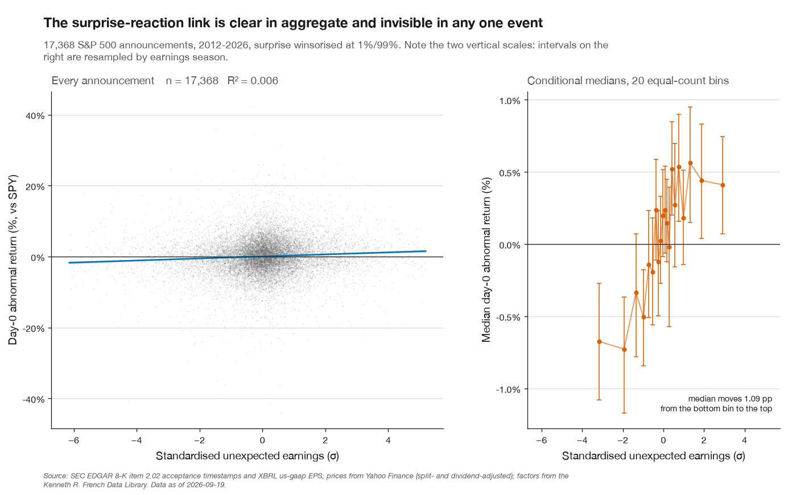
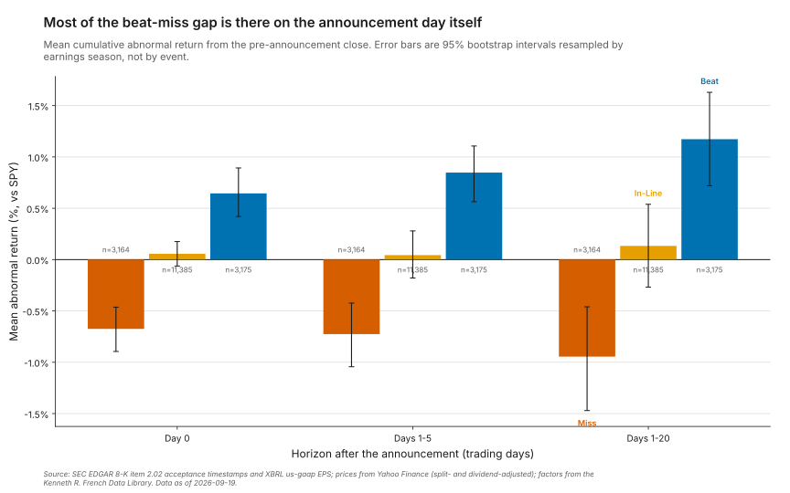
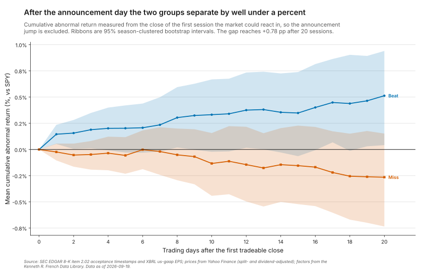
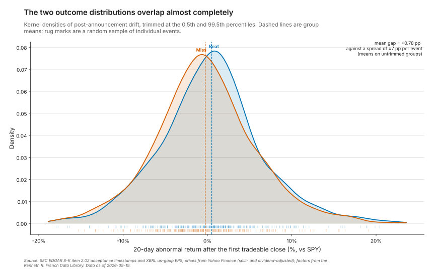
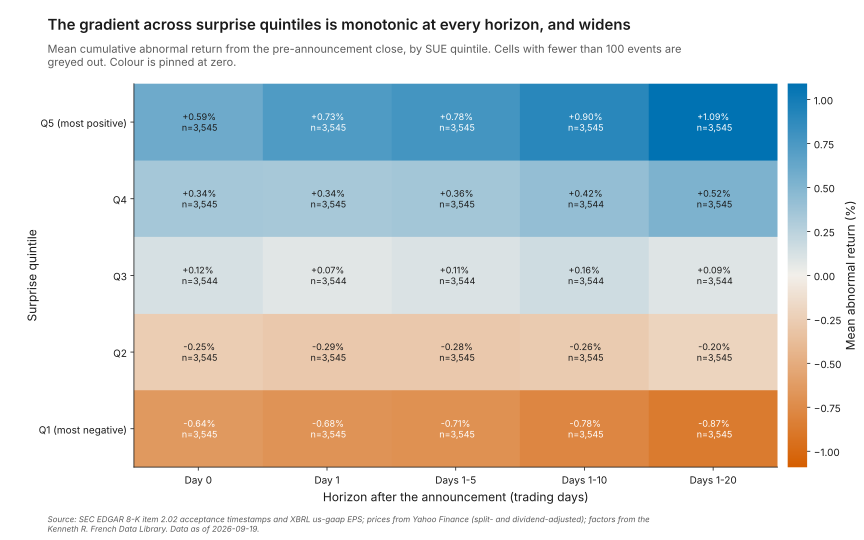
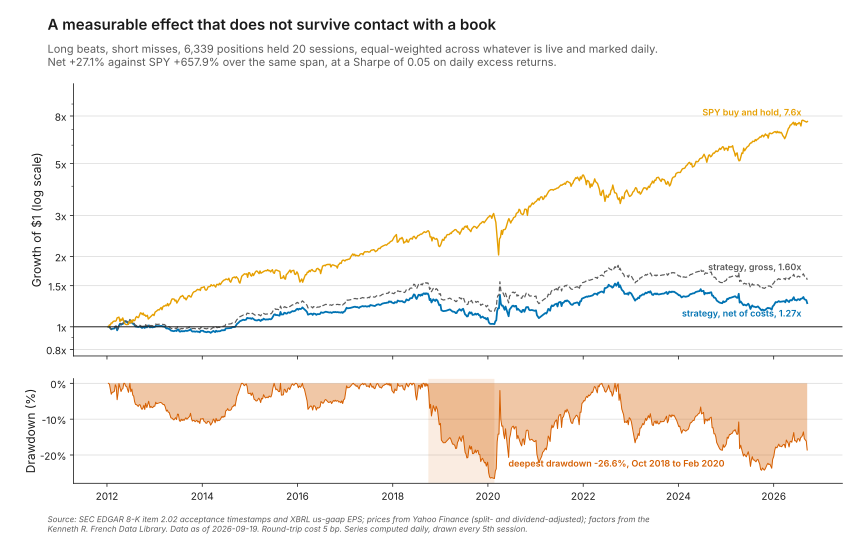
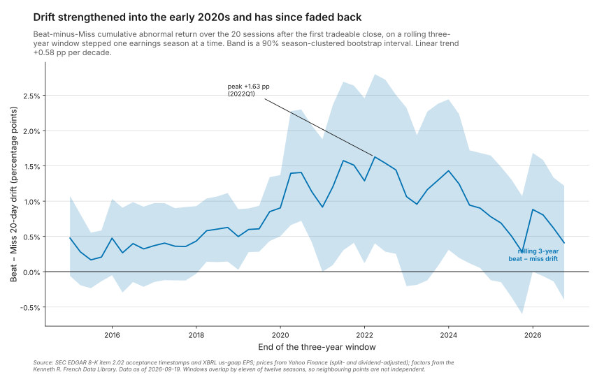
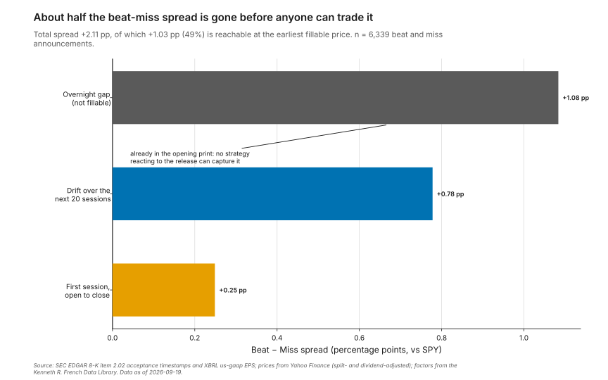
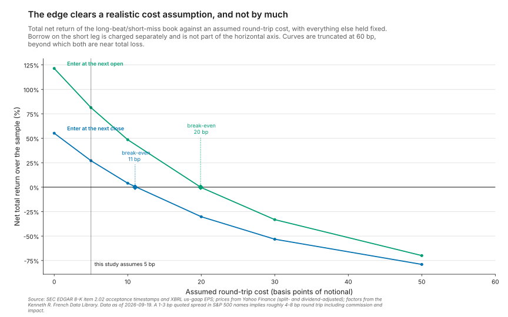

# earnings_surprise_analyzer

An event study of post-earnings announcement drift on US equities: point-in-time surprise
measurement, abnormal return windows, inference corrected for overlapping events, and a costed
backtest.

[](https://github.com/leeyawnnn/earnings_surprise_analyzer/actions/workflows/ci.yml)
[](LICENSE)
[](pyproject.toml)

## Results

17,724 earnings announcements from 444 S&P 500 companies, 2012-01-09 to 2026-08-19, dated by the
acceptance timestamp of the 8-K that carried the release.

**Post-earnings drift is real in this sample and is not worth trading.** The gap between companies
that beat and companies that miss keeps widening for a month after the announcement, and it
survives correcting the standard errors for overlapping windows. It is also about eight tenths of a
percentage point, most of what is left after the first day is unreachable, and a book built on it
returns less than a sixth of what the index returned over the same period at a fifth of the index's
Sharpe ratio. The distance between a measurable effect and a tradeable one is the point of this
repository.

| Beat − Miss spread, market-adjusted | Estimate | Naive p | Season-clustered p | Wild cluster p |
|---|---:|---:|---:|---:|
| Announcement day (day 0) | **+1.32 pp** | 9 × 10⁻²² | < 0.0001 | < 0.0001 |
| Day 0 through day 20 | **+2.12 pp** | 4 × 10⁻²¹ | < 0.0001 | < 0.0001 |
| Drift only, days 1–5 | **+0.26 pp** | 0.0066 | 0.0225 | 0.0284 |
| Drift only, days 1–20 | **+0.78 pp** | 9 × 10⁻⁶ | 0.0019 | 0.0035 |

"Drift only" measures from the close of the first session the market could react in, so the
announcement jump is excluded. That is the row PEAD is actually about. Bootstrap p-values are
floored at 1/(draws + 1), so "< 0.0001" means no resample out of 10,000 was as extreme, not a
precise figure. Source: [`docs/results/inference_tests.csv`](docs/results/inference_tests.csv).

Where the beat–miss spread lives, and what a strategy can reach:

| Component | Spread | Reachable? |
|---|---:|---|
| Overnight gap into the first session | +1.08 pp | No — the price is already there at the opening auction |
| First session, open to close | +0.25 pp | Yes, at the earliest fill |
| Drift over the next 20 sessions | +0.78 pp | Yes |
| **Total** | **+2.12 pp** | **49% of it** |

Trading it, 6,339 positions held 20 sessions, equal-weighted and marked daily:

| | Enter next close | Enter next open | SPY |
|---|---:|---:|---:|
| Total return, net | +27.1% | +81.3% | +657.9% |
| Annualised return | 1.6% | 4.1% | 14.8% |
| Annualised volatility | 10.0% | 10.5% | 16.5% |
| Sharpe (daily, net of bills) | 0.05 | 0.28 | 0.82 |
| Maximum drawdown | −26.6% | −27.8% | −33.7% |
| Break-even round-trip cost | 11 bp | 20 bp | — |

The break-even cost is the number worth keeping. At the 5 bp round trip this study assumes, roughly
half the gross edge is already gone; at 11 bp there is nothing left to take. Source:
[`docs/results/backtest_summary.csv`](docs/results/backtest_summary.csv),
[`docs/results/breakeven_cost.csv`](docs/results/breakeven_cost.csv).

Two further results, both negative in the useful sense:

- **The drift has not decayed.** Over rolling three-year windows the beat–miss spread strengthened
  from about +0.3 pp in 2015 to +1.6 pp in 2022 and has since fallen back to +0.4 pp. The linear
  trend across 48 windows is +0.58 pp per decade. There is no evidence here that the anomaly is
  being arbitraged away; there is evidence that it moves around a great deal.
- **The original version of this study could not have detected this effect.** Given the observed
  effect size and the dependence between events, a 100-event sample has about **6% power**. The
  present sample has 86%, and would need roughly 5,300 beat-and-miss events for 80%. It has 6,339.
  Source: [`docs/results/power_analysis.csv`](docs/results/power_analysis.csv).
- **The answer does not depend on how surprise is defined, though the two definitions barely
  agree.** Measured against analyst consensus instead of the firm's own history, the same 20-day
  drift spread is +0.56 pp (clustered p = 0.030) rather than +0.85 pp (p = 0.004) on the 15,152
  events that have both measures. The two rank-correlate at only 0.20 and put an announcement in the
  same bucket 43% of the time, so this is closer to an independent replication than a robustness
  check. See [Validation](#validation).

## Quickstart

```bash
git clone https://github.com/leeyawnnn/earnings_surprise_analyzer
cd earnings_surprise_analyzer
python -m pip install -e .

# Runs the whole study and redraws all nine figures against the committed
# 24-company sample. No network access required.
python main.py all --sample
```

To reproduce the published numbers rather than the sample, download the full dataset first. This
makes about 1,900 requests to SEC EDGAR and six batched requests to Yahoo, and took ten minutes
when the committed results were produced:

```bash
python -m pip install -r requirements.lock.txt   # the exact versions behind docs/
python main.py fetch
python main.py all
```

The continuous integration `quickstart` job runs the sample commands on a clean checkout on Linux
and macOS, so the block above is checked rather than asserted.

## What this is

Post-earnings announcement drift is the tendency of a stock to keep moving in the direction of its
earnings surprise for weeks after the announcement. Under a strict reading of market efficiency it
should not exist: the price should jump once, when the information arrives, and then follow a
random walk. Ball and Brown documented the drift in 1968 and it has appeared in every survey of
market anomalies since. The usual explanations are that investors under-react to the information
content of earnings, that they anchor on their prior estimates, and that the costs and risks of
arbitrage keep the mispricing from being competed away.

Measuring it requires getting three things right, and each of them is a place where a study can
quietly stop being one.

**When the news became public.** Earnings are released in an 8-K carrying item 2.02. EDGAR records
the acceptance timestamp of that filing to the second, so whether a release landed before the
opening bell or after the close is observable rather than assumed. In this sample 55% are before
the open, 39% after the close and 5% mid-session. Getting this wrong by a single session is the
difference between measuring drift and measuring the announcement itself — and the first version of
this repository dated events by the fiscal period end instead, two to four weeks before the results
existed.

**What counted as a surprise, using only what was known at the time.** Consensus estimates are the
economically natural benchmark, since the market trades against expectations rather than against
last year. But free consensus feeds serve today's consensus for a quarter that closed eight years
ago, with no record of when it was formed or whether it was revised after the announcement. So
surprise here is standardised unexpected earnings: this quarter's reported EPS less the same
quarter a year earlier, less the firm's recent drift, divided by how variable that error has been
for that firm over the previous eight quarters. Every input is a figure the company published on a
date EDGAR records, taken in its first-reported form before any restatement. This is Bernard and
Thomas's definition, and it is noisier than an analyst-based one — but it can be rebuilt exactly as
it stood the evening before the release, which the alternative cannot.

**Whether the statistics mean what they appear to.** Event studies of this kind routinely pool
thousands of observations and test them as if independent. They are not. Twenty-session windows
opened a fortnight apart in the same reporting season overlap almost entirely, and companies in one
index reporting in the same fortnight have correlated residuals even after a benchmark is
subtracted. The correction matters less here than one might expect, for a reason worth stating: a
shock common to a whole season lifts beats and misses alike and cancels out of a long-short spread.
What does not cancel is season-to-season variation in the spread itself, and that inflates the
sampling variance by a factor of 2.1 — enough to move a p-value from 10⁻⁵ to 0.003, not enough to
overturn it. The correction is decisive precisely where the original four-quarter version of this
study sat, near the edge of significance.

## Method

| Stage | Source file |
|---|---|
| Index membership, with join dates | [`src/esa/universe.py`](src/esa/universe.py) |
| 8-K item 2.02 timestamps and first-reported XBRL EPS | [`src/esa/sec.py`](src/esa/sec.py) |
| Standardised unexpected earnings | [`src/esa/surprise.py`](src/esa/surprise.py) |
| Reaction session, fillable session, return windows | [`src/esa/events.py`](src/esa/events.py) |
| Joins and the point-in-time guards | [`src/esa/pipeline.py`](src/esa/pipeline.py) |
| Naive, clustered and calendar-time inference | [`src/esa/inference.py`](src/esa/inference.py) |
| Spread, commission, impact and borrow costs | [`src/esa/costs.py`](src/esa/costs.py) |
| Daily-marked backtest | [`src/esa/backtest.py`](src/esa/backtest.py) |
| Rolling decay window | [`src/esa/decay.py`](src/esa/decay.py) |
| Analyst consensus, for the cross-check only | [`src/esa/consensus.py`](src/esa/consensus.py) |

Companies are bucketed by SUE at ±1σ, which puts about 18% of announcements in each extreme bucket.
Returns are measured against SPY over identical sessions. Positions are held 20 trading days,
equal-weighted across whatever is live, rebalanced and marked daily; the backtest reports both
entry conventions because the choice changes what is being measured, not merely how well it does.

Every filter is counted, so the sample can be audited rather than taken on trust —
[`docs/results/sample_audit.csv`](docs/results/sample_audit.csv) records that 28,723 quarterly EPS
figures become 17,724 events, with the largest single losses at the SUE warm-up requirement (−6,537)
and the index-membership filter (−2,672).

## Figures

Regenerate all nine with `python main.py figures`. Each is written with a `.meta.json` sidecar
recording the command, the commit and the vintage of the data behind it.

### The effect is real in aggregate and invisible in any single event



Every announcement plotted against the market-adjusted return of the session in which the market
first reacted, on the left, and the same data grouped into twenty equal-count bins on the right.
Read the two vertical scales: individual outcomes span forty percentage points while the conditional
median moves about one. Surprise size is a genuine but very weak predictor of any particular
announcement's reaction, which is why nothing in this repository rests on a single event.

### Most of the gap is there on the first day



Mean cumulative abnormal return for each bucket at three horizons, with 95% intervals resampled by
earnings season rather than by event. Beat bars rise and Miss bars fall as the horizon lengthens,
which is the drift; but the day-0 bars already account for nearly two-thirds of the eventual gap.
The In-Line bucket sits on zero throughout, which is what it should do.

### What is left after the announcement is small, and the bands overlap



Cumulative abnormal return measured from the close of the first tradeable session, so the
announcement jump is excluded entirely. The two curves separate steadily and end 0.78 pp apart. The
ribbons are season-clustered bootstrap intervals, and they overlap at every horizon — which is the
honest picture that two clean diverging lines would hide.

### The two outcome distributions are nearly the same distribution



Kernel densities of 20-day post-announcement drift for beats and misses, with group means marked.
The means differ by 0.78 pp against a per-event spread of about ±7 pp. The effect is a shift of
roughly a tenth of a standard deviation, so any individual trade tells you nothing and only the
aggregate does.

### The gradient across surprise quintiles is monotonic, and it widens



Mean abnormal return by SUE quintile and horizon, with the colour scale pinned at zero. Reading down
any column the gradient is monotonic from Q1 to Q5 at every horizon; reading across the top and
bottom rows, the extremes pull further apart as the window lengthens. Both directions are what PEAD
predicts, and this is the cleanest evidence in the repository that the effect is not an artefact of
where the bucket thresholds were placed.

### The effect does not survive contact with a book



Growth of a dollar on a log scale, with the drawdown beneath. The strategy compounds to 1.27× net of
costs against the index's 7.6×, and spends seventeen months in a drawdown that reaches −26.6%. A log
scale is used because on a linear one the strategy is a flat line along the floor, which hides the
drawdowns that are the most informative thing about it.

### The drift moves around far more than it fades



The beat–miss drift over rolling three-year windows, with a 90% season-clustered band. The expected
story was decay — an anomaly competed away as it became well known. That is not what the data shows:
the spread strengthened into 2022 and has since fallen back to roughly its mid-2010s level. Adjacent
windows share eleven of their twelve seasons, so read the level and the shape, not any single point.

### Half the spread is gone before anyone can trade



The beat–miss spread split into the overnight gap into the first session, that session's open-to-close
move, and the drift over the following month. The gap is the largest of the three and no strategy
reacting to the release can capture any of it, because the price has already moved by the time the
opening auction prints. This decomposition is the most useful thing this dataset has to say.

### The edge clears a realistic cost assumption, and not by much



Total net return as a function of assumed round-trip cost, with break-even marked for both entry
conventions. A strategy whose edge disappears at 11 bp is one whose profitability is a statement
about execution quality rather than about earnings.

## Validation

**The look-ahead guard.** `assert_no_lookahead` converts every fill to the instant it would have
happened — 09:30 or 16:00 Eastern on the entry session — and raises if any of them is at or before
its announcement timestamp. It runs over the real panel in the integration test, and one unit test
deliberately shifts the entry session back by one and asserts the guard catches it, so the guard
cannot decay into a no-op. See [`tests/test_events.py`](tests/test_events.py).

**The point-in-time guarantee.** Every input to a quarter's surprise measure carries the latest
filing date among the figures it used. An announcement is dropped unless it strictly postdates that,
and the integration test asserts the property holds across the whole panel.

**The null bucket.** In-Line announcements should show no abnormal move, and they do not: +0.00 pp
of overnight gap and +0.07 pp of 20-day drift, against +1.08 and +0.78 for the beat–miss spread.
Nothing forces this, so it is a useful check that the benchmark adjustment and the event-date
alignment are not manufacturing returns.

**The inference, against known answers.** The corrected tests are run on synthetic samples with a
planted effect and with a planted null. All three find the effect; the corrected two leave the null
alone while the naive test rejects it on more than a fifth of draws. The calendar-time regression
recovers a planted daily alpha with the right factor loading and finds no alpha in a series that is
pure market exposure.

**Hand-computed accounting.** The backtest is checked against a two-position fixture where every
expected figure is worked out by hand in the assertion, including the cost deduction. Two defects
were found this way: exit-day turnover was never charged, so a round trip cost about half what it
should; and per-trade returns were summed rather than compounded.

**Cross-method agreement.** The calendar-time portfolio sidesteps overlap entirely rather than
correcting for it, and gives the same sign: a four-factor alpha of +3.5 bp a day on the long-short
spread, t = 2.2. Its momentum loading is +0.25, so a quarter of what a market-only regression would
have called alpha is a momentum tilt — which is why the momentum factor is in the model.

**The result under the other definition of surprise.** The study measures surprise against the
firm's own earnings history because that can be rebuilt point-in-time. The obvious objection is that
the market trades against analyst expectations instead, so the whole exercise might be measuring the
wrong thing. Re-running the drift test against deviation from consensus, on the 15,152 events where
both measures exist:

| Surprise definition | Beats | Misses | 20-day drift spread | Naive p | Clustered p |
|---|---:|---:|---:|---:|---:|
| Standardised unexpected earnings | 2,775 | 2,596 | +0.85 pp | < 0.0001 | 0.0040 |
| Percent deviation from consensus | 7,280 | 1,458 | +0.56 pp | 0.0122 | 0.0297 |

Same sign, same order of magnitude, significant under both. What is striking is how little the two
measures agree on: they rank-correlate at 0.20 and assign the same bucket to only 43% of
announcements. The lopsided consensus counts are the familiar pattern of companies guiding
expectations down and then clearing them — five beats for every miss, against a near-even split on
the firm's own history. Two measures this different arriving at the same answer is closer to an
independent replication than to a robustness check.

The consensus figures are the ones this repository argues should not be trusted for a point-in-time
study, and using them here does not contradict that: they are a cross-check on a result established
without them, not an input to it. Source:
[`docs/results/surprise_definition_comparison.csv`](docs/results/surprise_definition_comparison.csv),
produced by `python scripts/fetch_consensus.py` followed by `python main.py study`.

145 tests, 89% line coverage, run on Python 3.11, 3.12 and 3.13.

## Limitations

These are the things I would want a reader to hold against this study.

**My universe is survivorship-biased and I can only half-fix it.** The membership snapshot is
current, so it contains no company that left the index — no Lehman, no Bear Stearns, none of the
names that were dropped after a bad decade. I exclude each company before its documented join date,
which removes the backfill error of studying a 2013 report from a company that joined in 2021, but
nothing recovers the companies that are simply absent. The direction is knowable: survivors did
better than the index, so levels are flattered. It matters less than it might, because every
headline number here is a beat-minus-miss spread and the bias hits both legs.

**I assume the EPS in the 10-Q equals the EPS in the press release.** XBRL gives me a filing-dated
figure, but the filing is the 10-Q, which lands days after the 8-K that announced the result. The
number was public at the 8-K; I am sourcing it from the later document. This is true in the large
majority of cases and I have not verified it case by case. Where a company revised between the press
release and the filing, my surprise is slightly wrong.

**Fourth quarters are partly derived.** Filers disclose only the full year in the 10-K, so fiscal Q4
EPS is recovered as the annual figure less the three quarters inside it. Per-share figures do not
add up exactly when the diluted share count moves during the year, so those rows carry a small
error. They are flagged in the panel but the headline numbers do not exclude them.

**GAAP EPS is not what the market trades on.** The figure I use includes one-off items that the
street excludes. A quarter with a large impairment looks like a huge miss on my measure and may have
been in line on the number the market was watching. This adds noise and probably biases the measured
effect toward zero.

**I could not use analyst expectations as the primary measure, and that is a real cost.** Surprise
relative to consensus is economically sharper than surprise relative to last year. The free source
is a current snapshot with no revision history, so using it as the signal would import
post-announcement information. I use it only as the cross-check in Validation, where a contaminated
measure agreeing with a clean one is informative and a contaminated measure driving the headline
would not be. A paid point-in-time source — I/B/E/S, Zacks — is the right answer and I do not have
one.

**The costs are assumptions, not measurements.** 0.5 bp commission, a 1 bp half-spread, square-root
impact at 1% participation and 40 bp annual borrow are reasonable for large-cap US equities and are
not calibrated to anything. This is why the break-even cost is the headline rather than the net
Sharpe: it is the one number that does not depend on my believing my own cost model. I also assume
shorts are always available and never recalled, which is the least defensible assumption in the
backtest even in index constituents.

**Mega-caps are where PEAD should be weakest.** The documented effect is strongest in small and
illiquid stocks, where attention is scarce and arbitrage is expensive. An S&P 500 universe is biased
against finding drift, so the small effect here is not evidence that the anomaly is small
everywhere — and, symmetrically, a larger effect in small caps would come with costs that this
break-even analysis suggests would eat it.

**One market, one currency, one regime.** Fourteen years of US large caps, most of it a bull market
with a brief and violent interruption. I would not carry the magnitudes to another market.

**Two numbers are hardware- and seed-dependent.** Bootstrap p-values move in the fourth decimal
between seeds; the run behind this README used seed 20240719 with 10,000 draws. Nothing in the
tables is sensitive to that at the precision quoted.

**What I would do with more time.** Reconstruct point-in-time index membership from the index
changes history to close the survivorship gap; extend the universe down the market-cap distribution
to test whether the effect is larger where theory says it should be; and model borrow availability
rather than assuming it.

## Data sources

| Source | What it provides | URL | As of | Terms |
|---|---|---|---|---|
| SEC EDGAR submissions API | 8-K item 2.02 filings with acceptance timestamps | `https://data.sec.gov/submissions/CIK##########.json` | 2026-09-19 | US government work, no copyright; ≤10 requests/second with a descriptive User-Agent |
| SEC EDGAR XBRL company concept | First-reported diluted EPS per fiscal period | `https://data.sec.gov/api/xbrl/companyconcept/CIK##########/us-gaap/EarningsPerShareDiluted.json` | 2026-09-19 | as above |
| Yahoo Finance, via `yfinance` | Split- and dividend-adjusted daily opens and closes | `https://finance.yahoo.com` | 2026-09-19 | personal, non-commercial use |
| Yahoo Finance earnings calendar | Analyst consensus EPS, for the cross-check only | `https://finance.yahoo.com` | 2026-09-19 | personal, non-commercial use; a current snapshot, not point-in-time |
| Kenneth R. French Data Library | Daily Mkt-RF, SMB, HML, momentum and the one-month bill rate | `https://mba.tuck.dartmouth.edu/pages/faculty/ken.french/data_library.html` | 2026-07-31 | research use, with attribution |
| Wikipedia, "List of S&P 500 companies" | Constituent tickers, sectors, CIKs and index join dates | `https://en.wikipedia.org/wiki/List_of_S%26P_500_companies` | 2026-09-19 | CC BY-SA 4.0 |

Refresh filings, prices and factors with `python main.py fetch`; refresh the universe snapshot
deliberately with `python main.py snapshot-universe`, which changes every published number. The
factor file ends 2026-07-31, so the calendar-time regression stops there while the event study runs
to 2026-08-19. Redistributed extracts and their licences are listed in [NOTICE](NOTICE).

## References

- Ball, R. and Brown, P. (1968). "An Empirical Evaluation of Accounting Income Numbers." *Journal of
  Accounting Research* 6(2), 159–178. The original documentation of the drift.
- Bernard, V. L. and Thomas, J. K. (1989). "Post-Earnings-Announcement Drift: Delayed Price Response
  or Risk Premium?" *Journal of Accounting Research* 27, 1–36. The standardised unexpected earnings
  definition used here, and the risk-versus-mispricing argument.
- Bernard, V. L. and Thomas, J. K. (1990). "Evidence that Stock Prices Do Not Fully Reflect the
  Implications of Current Earnings for Future Earnings." *Journal of Accounting and Economics* 13(4),
  305–340.
- Fama, E. F. (1998). "Market efficiency, long-term returns, and behavioral finance." *Journal of
  Financial Economics* 49(3), 283–306. Section 4 on why calendar-time portfolios are preferred for
  overlapping long-horizon events.
- Mitchell, M. L. and Stafford, E. (2000). "Managerial Decisions and Long-Term Stock Price
  Performance." *Journal of Business* 73(3), 287–329. On cross-sectional dependence inflating
  event-study test statistics.
- Cameron, A. C., Gelbach, J. B. and Miller, D. L. (2008). "Bootstrap-Based Improvements for
  Inference with Clustered Errors." *Review of Economics and Statistics* 90(3), 414–427. The wild
  cluster bootstrap.
- Chordia, T. and Shivakumar, L. (2006). "Earnings and Price Momentum." *Journal of Financial
  Economics* 80(3), 627–656. On the overlap between the drift and price momentum, which is why
  momentum is a control in the calendar-time regression.

Licensed under Apache 2.0. This is a research exercise, not investment advice.
